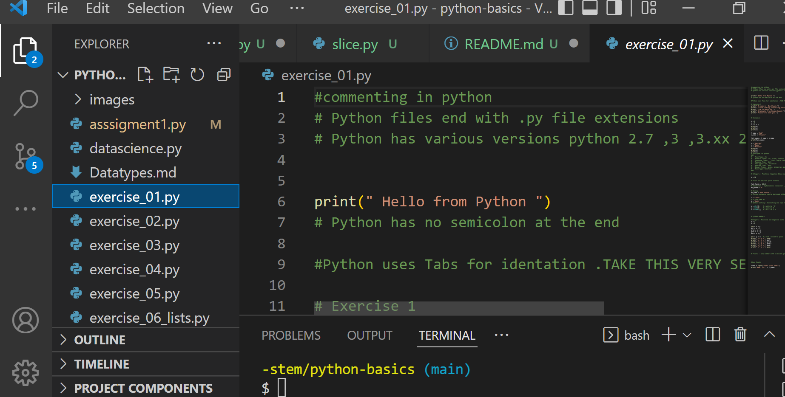

### Inspire Youth in STEM 

## Week 1 : Introduction to python 
Day 1 : installing python 

Add a link to python download 
https://www.python.org/downloads/

Add link to downloading vs code 

Add link to downloading git for windows 

strings 
     replace() 
     strip()
     slice()
     format()
     upper()
     lower()
     len()

## Week 2 : Electronics for Innovators 

## Week 3 : Introduction to Robotics 

## Week 4 : Javascript ,css , html 

## Week 5 : Design Thinking ,UX ,UI

## Week 6 : Pitch Competition , Campus tour 